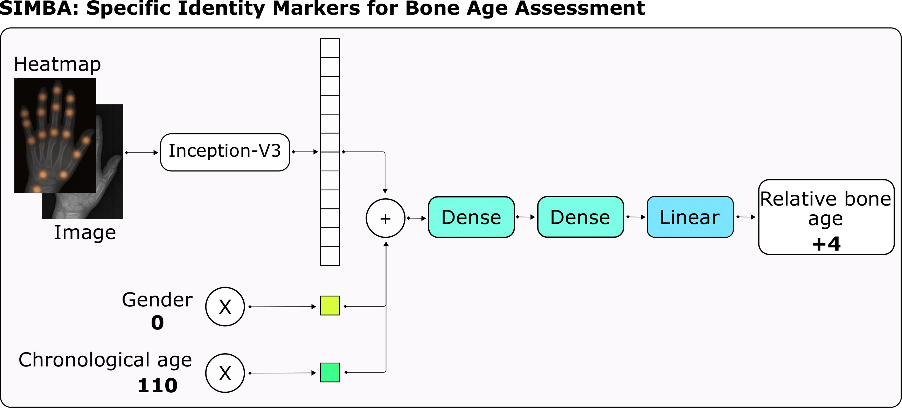

# **SIMBA: Specific Identity Markers for Bone Age Assessment**

This repository provides a PyTorch implementation of SIMBA, presented in the paper [SIMBA: Specific Identity Markers for Bone Age Assessment](https://link.springer.com/chapter/10.1007/978-3-030-59725-2_73). Presented at [MICCAI,2020](https://www.miccai2020.org/).  SIMBA is a novel approach for the task of BAA based on the use of identity markers. For this purpose, we build upon the [state-of-the-art model](https://github.com/BCV-Uniandes/Bonet), fusing the information present in the identity markers with the visual features created from the original hand radiograph. We then use this robust representation to estimate the patient’s relative bone age: the difference between chronological age and bone age.
<br/>

## Paper
[SIMBA: Specific Identity Markers for Bone Age Assessment](https://link.springer.com/chapter/10.1007/978-3-030-59725-2_73) <br/>
 [Cristina González](https://cigonzalez.github.io/)<sup> 1* </sup>, [María Escobar](https://mc-escobar11.github.io/)<sup> 1* </sup>,[Laura Daza](https://sites.google.com/view/ldaza/en)<sup>1</sup>,[Felipe Torres](https://ftorres11.github.io/) <sup>1</sup>, [Gustavo Triana](http://radiologiafsfb.org/site/index.php?option=com_content&view=category&id=176&Itemid=332)<sup>2</sup>, [Pablo Arbeláez](https://scholar.google.com.co/citations?user=k0nZO90AAAAJ&hl=en)<sup>1</sup> <br/>
<sup>*</sup>Equal contribution.<br/>
<sup>1 </sup> Center for Research and Formation in Artificial Intelligence ([CINFONIA](https://cinfonia.uniandes.edu.co/)) , Universidad de Los Andes. <br/>
<sup>2 </sup>Radiology department, Fundación Santa Fe de Bogotá. <br/>
<br/>

<p align="center"></p>


## Dependencies
* Pytorch 1.3.1
* Pandas 1.0.1
* Horovod 0.19.1
* Tqdm 4.42.1
* Scipy 1.3.2


## Usage
### Cloning the repository
```bash
$ git clone https://github.com/BCV-Uniandes/SIMBA.git
$ cd simba
```
### Train setup:
Modify the routes in train_net.sh according to your local paths. Use the flags for training the different versions of SIMBA. 
```bash
bash train_net.sh
```
### Test setup:
Modify the routes in test_net.sh according to your local paths. Use the flags for evaluating the different versions of SIMBA. 
```bash
bash test_net.sh
```
## Pretrained models
Pretrained models will be available soon. 

| Gender multiplier 	| Chronological age multiplier 	| Relative bone age 	| Subset     	|  MAD 	| Pretrained model 	|
|:-----------------:	|:----------------------------:	|:-----------------:	|------------	|:----:	|------------------	|
|         x         	|               x              	|                   	| Validation 	| 6.50 	|         model1         	|
|         x         	|                              	|         x         	| Validation 	| 8.72 	|         model2         	|
|                   	|               x              	|         x         	| Validation 	| 7.33 	|        model3          	|
|         x         	|               x              	|         x         	| Validation 	| 6.34 	|        model4          	|
|         x         	|               x              	|         x         	| **Test**       	| **5.47** 	|          model5       	|
## Citation
```
@inproceedings{gonzalez2020simba,
  title={SIMBA: Specific Identity Markers for Bone Age Assessment},
  author={Gonz{\'a}lez, Cristina and Escobar, Mar{\'\i}a and Daza, Laura and Torres, Felipe and Triana, Gustavo and Arbel{\'a}ez, Pablo},
  booktitle={International Conference on Medical Image Computing and Computer-Assisted Intervention},
  pages={753--763},
  year={2020},
  organization={Springer}
}

```

